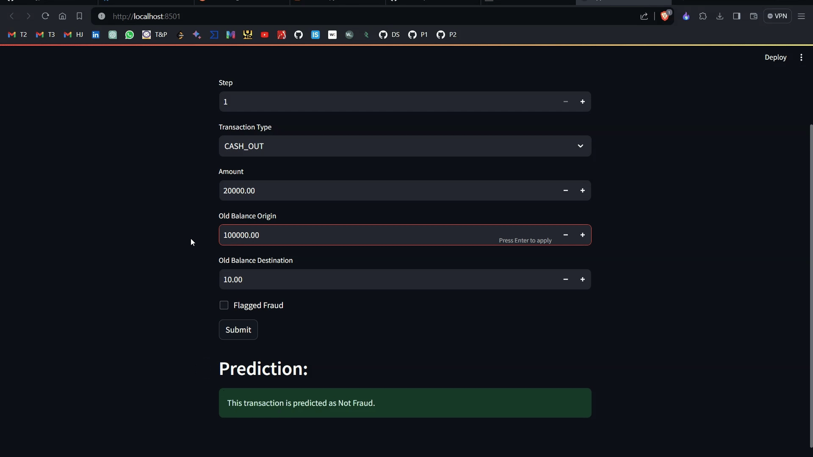

# Fraudulent-Transactions-Prediction


## Overview

This repository contains a Fraud Detection project that focuses on predicting whether a financial transaction is fraudulent or not. The project utilizes machine learning models, specifically the Random Forest Classifier. The trained model is saved for future use, and a Streamlit app is provided for easy interaction with the model.

## Data

The dataset used for training and analysis is named `Fraud.csv`. It consists of 6362620 rows and 10 columns, containing various features related to financial transactions.

## Project Structure

The project folder includes the following files:

1. `model.sav`: The saved Random Forest Classifier model.
2. `scaler.sav`: The saved StandardScaler object used for feature scaling.
3. `Requirements.txt`: A file containing the required dependencies for the project.
4. `app.py`: A Streamlit app that allows users to input transaction details and receive predictions.
5. `fraud-detection.ipynb`: A Jupyter Notebook file containing the exploratory data analysis (EDA), data preprocessing, model training, and evaluation.

## How to Use

### Installation

Make sure you have the following installed:

- Python (version 3.6 or higher)
- Pip (package installer for Python)

1. Clone the repository to your local machine:

    ```bash
    git clone https://github.com/hardikjp7/Fraudulent-Transactions-Prediction.git
    ```

2. Navigate to the project directory:

    ```bash
    cd Fraudulent-Transactions-Prediction
    ```

3. Install the required dependencies:

    ```bash
    pip install -r requirements.txt
    ```

### Usage

#### Streamlit App

1. Ensure you have the required dependencies installed.
2. Run the Streamlit app:

    ```bash
    streamlit run app.py
    ```

3. Open your web browser to use the Fraud Detection App.

#### Model Deployment

If you want to use the trained model programmatically:

```python
import pickle
import numpy as np

# Load the saved model and scaler
model = pickle.load(open('model.sav', 'rb'))
scaler = pickle.load(open('scaler.sav', 'rb'))

# Create an input array with transaction details
input_array = np.array([[228, 5, 117563.11, 0.0, 208908.41, 0]])

# Scale the input array
input_array_scaled = scaler.transform(input_array)

# Make a prediction
prediction = model.predict(input_array_scaled)

print("Prediction:", prediction)
```

Remember to adjust the input array according to the specific details of the transaction you want to predict.

## Demo



